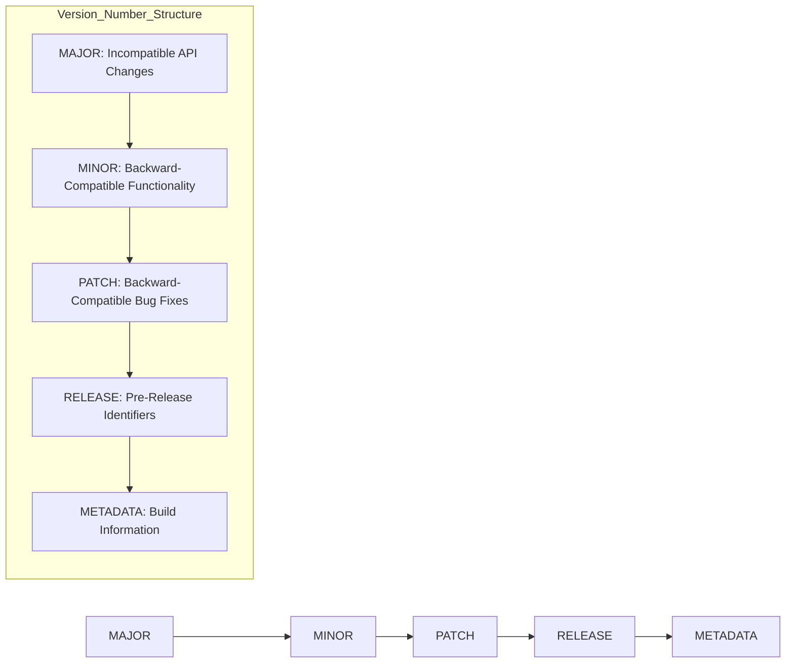
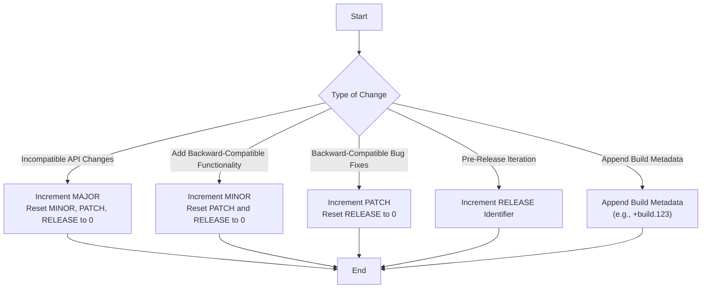
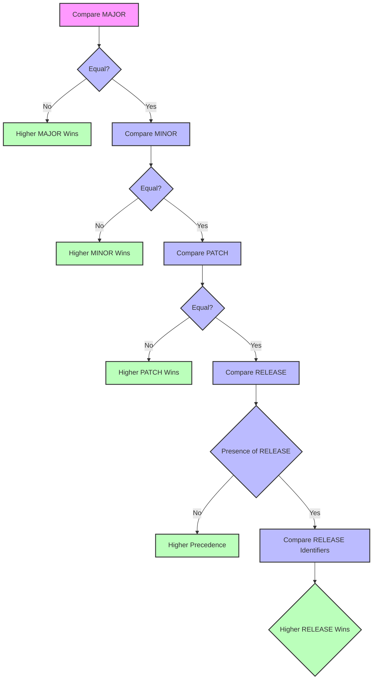
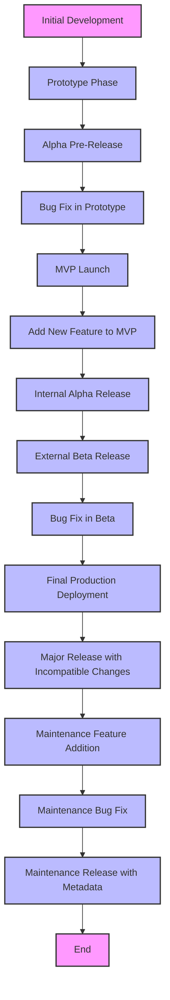
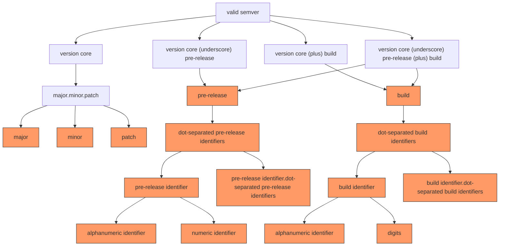

# Semantic Versioning 3.0.0_0 - Mermaid Diagrams

To enhance the understanding of the **Semantic Versioning 3.0.0_0** framework, the following Mermaid diagrams have been created. These diagrams visually represent the versioning structure, incrementing rules, precedence comparison, and the overall versioning workflow.

---

## 1. Version Number Structure

This diagram illustrates the components of the Semantic Versioning 3.0.0_0 version number format.



### Explanation:
- **MAJOR:** Indicates incompatible API changes.
- **MINOR:** Denotes the addition of functionality in a backward-compatible manner.
- **PATCH:** Represents backward-compatible bug fixes.
- **RELEASE:** Signifies pre-release identifiers (e.g., alpha, beta, rc).
- **METADATA:** Contains build metadata for additional context.

---

## 2. Incrementing Rules Flowchart

This flowchart guides the decision-making process for incrementing different components of the version number based on the type of changes made.



### Explanation:
- **Incompatible API Changes:** Increment the MAJOR version and reset MINOR, PATCH, and RELEASE to `0`.
- **Add Backward-Compatible Functionality:** Increment the MINOR version and reset PATCH and RELEASE to `0`.
- **Backward-Compatible Bug Fixes:** Increment the PATCH version and reset RELEASE to `0`.
- **Pre-Release Iteration:** Increment the RELEASE identifier for new pre-release versions.
- **Append Build Metadata:** Append build metadata using the `+` delimiter.

---

## 3. Version Precedence Comparison

This diagram demonstrates how different version numbers are compared to determine their precedence.



### Explanation:
1. **Compare MAJOR:** Versions with higher MAJOR numbers have higher precedence.
2. **Compare MINOR:** If MAJOR versions are equal, compare MINOR versions.
3. **Compare PATCH:** If both MAJOR and MINOR are equal, compare PATCH versions.
4. **Compare RELEASE:** If MAJOR, MINOR, and PATCH are equal, versions without a RELEASE identifier have higher precedence than those with one. If both have RELEASE identifiers, compare them lexically and numerically.

**Examples:**
- `1.0.0_0` < `1.0.0_1`
- `1.0.0_1` < `1.0.0_2`
- `1.0.0_2` < `1.0.1_0`
- `1.1.0_0` < `2.0.0_0`

---

## 4. Versioning Workflow

This diagram outlines the typical workflow of versioning from initial development to maintenance using Semantic Versioning 3.0.0_0.



### Explanation:
1. **Initial Development:** Start with version `0.0.0_0`.
2. **Prototype Phase:** Increment MINOR for initial feature additions (e.g., `0.1.0_0`).
3. **Alpha Pre-Release:** Release an alpha version (e.g., `0.1.0_1`).
4. **Bug Fix in Prototype:** Increment PATCH for bug fixes (e.g., `0.1.1_0`).
5. **MVP Launch:** Transition to MVP with MAJOR version increment (e.g., `1.0.0_0`).
6. **Add New Feature to MVP:** Increment MINOR for new features (e.g., `1.1.0_0`).
7. **Internal Alpha Release:** Release an internal alpha version (e.g., `1.1.0_1`).
8. **External Beta Release:** Release an external beta version (e.g., `1.1.0_2`).
9. **Bug Fix in Beta:** Increment PATCH for bug fixes (e.g., `1.1.1_0`).
10. **Final Production Deployment:** Deploy to production with metadata (e.g., `1.1.1_1+build.123`).
11. **Major Release with Incompatible Changes:** Increment MAJOR and append new metadata (e.g., `2.0.0_0+build.456`).
12. **Maintenance Feature Addition:** Increment MINOR during maintenance (e.g., `2.1.0_0+build.456`).
13. **Maintenance Bug Fix:** Increment PATCH during maintenance (e.g., `2.1.1_0+build.456`).
14. **Maintenance Release with Metadata:** Append metadata during maintenance (e.g., `2.1.1_1+build.789`).
15. **End:** Lifecycle concludes.

---

## 5. BNF Grammar Representation

While Mermaid does not natively support BNF grammar diagrams, the adapted Backus–Naur Form (BNF) grammar can be represented using a flowchart to visualize the structure of valid Semantic Versioning 3.0.0_0 strings.



### Explanation:
- **Valid SemVer:** The root node representing a valid semantic version.
- **Version Core:** Consists of MAJOR, MINOR, and PATCH.
- **Pre-Release and Build:** Optional components that can be appended to the version core.
- **Identifiers:** Define the structure of pre-release and build metadata.

---

## 6. Adapted Backus–Naur Form (BNF) Grammar

For a detailed representation of the adapted BNF grammar, refer to the **Adapted Backus–Naur Form (BNF) Grammar** section in the documentation.

```plaintext
<valid semver> ::= <version core>
                 | <version core> "_" <pre-release>
                 | <version core> "+" <build>
                 | <version core> "_" <pre-release> "+" <build>

<version core> ::= <major> "." <minor> "." <patch>

<major> ::= <numeric identifier>

<minor> ::= <numeric identifier>

<patch> ::= <numeric identifier>

<pre-release> ::= <dot-separated pre-release identifiers>

<dot-separated pre-release identifiers> ::= <pre-release identifier>
                                          | <pre-release identifier> "." <dot-separated pre-release identifiers>

<build> ::= <dot-separated build identifiers>

<dot-separated build identifiers> ::= <build identifier>
                                    | <build identifier> "." <dot-separated build identifiers>

<pre-release identifier> ::= <alphanumeric identifier>
                           | <numeric identifier>

<build identifier> ::= <alphanumeric identifier>
                     | <digits>

<alphanumeric identifier> ::= <non-digit>
                            | <non-digit> <identifier characters>
                            | <identifier characters> <non-digit>
                            | <identifier characters> <non-digit> <identifier characters>

<numeric identifier> ::= "0"
                       | <positive digit>
                       | <positive digit> <digits>

<identifier characters> ::= <identifier character>
                          | <identifier character> <identifier characters>

<identifier character> ::= <digit>
                         | <non-digit>

<non-digit> ::= <letter>
              | "-"

<digits> ::= <digit>
           | <digit> <digits>

<digit> ::= "0"
          | <positive digit>

<positive digit> ::= "1" | "2" | "3" | "4" | "5" | "6" | "7" | "8" | "9"

<letter> ::= "A" | "B" | "C" | "D" | "E" | "F" | "G" | "H" | "I" | "J"
           | "K" | "L" | "M" | "N" | "O" | "P" | "Q" | "R" | "S" | "T"
           | "U" | "V" | "W" | "X" | "Y" | "Z"
           | "a" | "b" | "c" | "d" | "e" | "f" | "g" | "h" | "i" | "j"
           | "k" | "l" | "m" | "n" | "o" | "p" | "q" | "r" | "s" | "t"
           | "u" | "v" | "w" | "x" | "y" | "z"
```

---

## 7. Conclusion

The **Semantic Versioning 3.0.0_0 - Mermaid Diagrams** documentation provides a comprehensive visual and descriptive guide to understanding and implementing the adapted Semantic Versioning system. By leveraging Mermaid diagrams, complex versioning concepts are broken down into intuitive and easily digestible visual formats, facilitating better comprehension and application.

### Key Highlights:
- **Clear Structure:** Diagrams illustrate the hierarchical components of the version number, ensuring clarity in understanding each segment's purpose.
- **Incrementing Rules:** Flowcharts guide the appropriate version increments based on the nature of changes, promoting consistency and predictability.
- **Precedence Comparison:** Visual representations aid in grasping how different versions relate to each other in terms of precedence.
- **Workflow Visualization:** The versioning workflow diagram encapsulates the entire lifecycle from initial development to maintenance, providing a holistic view.
- **Grammar Representation:** BNF diagrams translate the formal grammar rules into visual formats, bridging the gap between theoretical specifications and practical understanding.

### How to Use These Diagrams:
1. **Reference During Development:** Utilize the diagrams as a reference to determine when and how to increment version numbers based on the changes introduced.
2. **Educate Team Members:** Share the documentation with your development team to ensure a unified understanding of the versioning strategy.
3. **Integrate into Documentation:** Embed these diagrams within your project's documentation to provide clear guidelines for contributors and stakeholders.
4. **Automate Versioning Processes:** Leverage the incrementing rules flowchart to automate version bumps within your CI/CD pipelines, ensuring adherence to the versioning scheme.

### Future Enhancements:
- **Interactive Diagrams:** Consider making the diagrams interactive for enhanced user engagement and exploration.
- **Extended Examples:** Incorporate more real-world scenarios and examples to further elucidate the versioning principles.
- **Integration with Tools:** Explore integrations with versioning tools and plugins that can generate or validate version numbers based on the documented rules.

By adhering to the **Semantic Versioning 3.0.0_0** framework and utilizing the accompanying Mermaid diagrams, projects can achieve a more structured, transparent, and scalable approach to version management, ultimately contributing to smoother development cycles and more reliable software releases.
